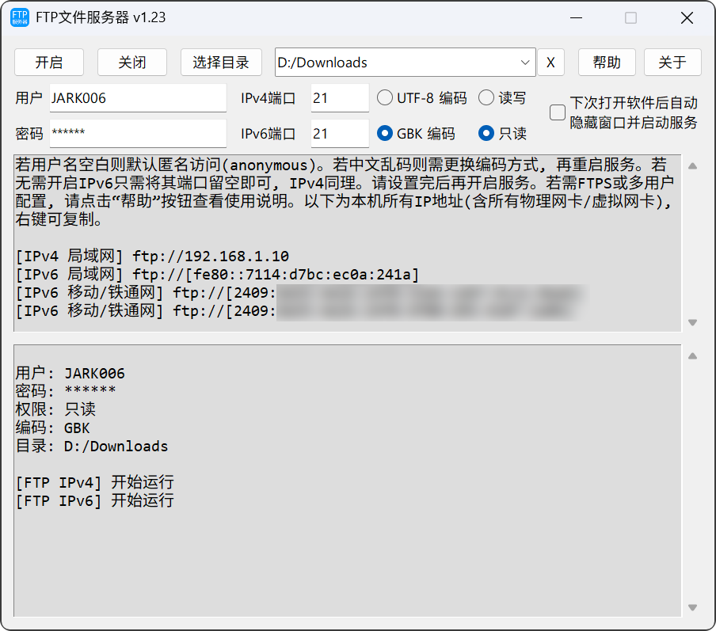

## FTP文件服务器

一键开启FTP文件服务器，方便其他设备通过网络传输、管理文件，支持IPv4，IPv6。

---

### 多用户配置

在主程序所在目录新建文件 `FtpServerUserList.csv` ，使用`Excel`或文本编辑器(需熟悉csv文件格式)编辑，一行一个配置：

第一列：用户名，限定英文大小写/数字

第二列：密码，限定英文大小写/数字/符号

第三列：权限，使用`readonly`或`只读`(需保证文本格式为UTF-8) 设置`只读权限`。使用`readwrite`或`读写`设置`读写权限`，或者使用自定义，从以下权限挑选自行组合：

参考链接：https://pyftpdlib.readthedocs.io/en/latest/api.html#pyftpdlib.authorizers.DummyAuthorizer.add_user
        
        读取权限：
        - "e" = 更改目录 (CWD 命令)
        - "l" = 列出文件 (LIST、NLST、STAT、MLSD、MLST、SIZE、MDTM 命令)
        - "r" = 从服务器检索文件 (RETR 命令)

        写入权限：
        - "a" = 将数据附加到现有文件 (APPE 命令)
        - "d" = 删除文件或目录 (DELE、RMD 命令)
        - "f" = 重命名文件或目录 (RNFR、RNTO 命令)
        - "m" = 创建目录 (MKD 命令)
        - "w" = 将文件存储到服务器 (STOR、STOU 命令)
        - "M" = 更改文件模式 (SITE CHMOD 命令)
        - "T" = 更新文件上次修改时间 (MFMT 命令)

第四列：根目录路径

### 例如

|||||
|-|-|-|-|
| JARK006|123456|readonly|D:\Downloads|
| JARK007|456789|readwrite|D:\Data|
| JARK008|abc123|只读|D:\FtpRoot|
| JARK009|abc456|elr|D:\FtpRoot|
| ...||||

### 其他

    若读取到有效配置，则自动禁用主页面的用户/密码设置。
    若临时不需多用户配置，可将文件重命名为其他名称。

---

### 使用到的第三方组件或服务

1. [pyftpdlib](https://github.com/giampaolo/pyftpdlib)

1. [tkinter](https://docs.python.org/3/library/tkinter.html)

1. [pystray](https://github.com/moses-palmer/pystray)

1. [Pillow](https://github.com/python-pillow/Pillow)

---

### 预览

